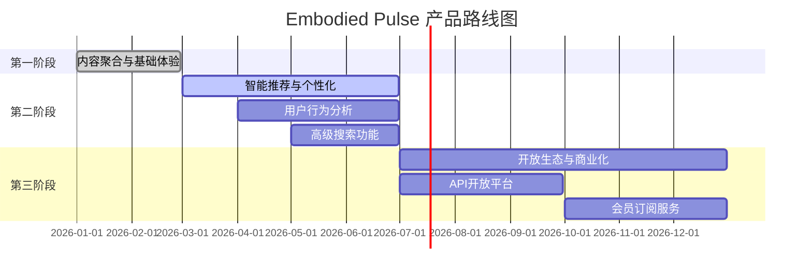

# Embodied Pulse 产品管理文档

**文档版本**: v1.1
**创建日期**: 2026-02-28
**最后更新**: 2026-02-28
**维护人**: Dong
**文档状态**: 正式发布

---

## 目录

1. [产品概述](#1-产品概述)
2. [核心功能模块](#2-核心功能模块)
3. [开发进度看板](#3-开发进度看板)
4. [历史迭代记录](#4-历史迭代记录)
5. [短期目标](#5-短期目标)
6. [长期规划](#6-长期规划)
7. [修改记录机制](#7-修改记录机制)

---

## 1. 产品概述

### 1.1 产品基本信息

| 属性 | 内容 |
|------|------|
| 产品名称 | Embodied Pulse（具身智能脉搏） |
| 产品定位 | 面向具身智能领域的专业化信息流聚合平台 |
| 产品类型 | Web 端信息流社区平台 |
| 目标用户 | 具身智能领域研究人员、机器人工程师、AI/ML 学生、科技从业者 |
| 技术栈 | Next.js 14 + Express + Prisma + SQLite/PostgreSQL + Redis |

### 1.2 产品愿景与使命

**愿景**：打造具身智能领域最专业、最全面的信息聚合平台。

**使命**：帮助研究者和工程师更高效地发现、跟踪和分享具身智能领域的最新进展。

### 1.3 核心价值主张

| 价值主张 | 说明 |
|----------|------|
| 信息聚合 | 统一的信息流展示，汇聚来自不同来源的优质内容 |
| 社区互动 | 完整的社区功能体系，包括帖子、评论、收藏、订阅、关注 |
| 零门槛访问 | 渐进式功能解锁，未登录用户可浏览所有公开内容 |
| 数据真实 | 严格的数据校验机制，确保内容来源可靠 |

### 1.4 产品发展阶段

| 阶段 | 目标 | 状态 | 核心指标 |
|------|------|------|----------|
| 第一阶段 | 内容聚合与基础体验 | ✅ 已完成 | 内容覆盖率、用户留存率 |
| 第二阶段 | 智能推荐与个性化 | 🔄 进行中 | 推荐准确率、用户粘性 |
| 第三阶段 | 开放生态与商业化 | 📋 待开始 | API调用量、商业收入 |

---

## 2. 核心功能模块

### 2.1 模块总览

| 模块编号 | 模块名称 | 模块类型 | 功能描述 | 优先级 |
|----------|----------|----------|----------|--------|
| M01 | 首页发现 | 用户端 | 信息流聚合展示、智能推荐 | P0 |
| M02 | 论文中心 | 用户端 | 论文搜索、筛选、详情 | P0 |
| M03 | 视频中心 | 用户端 | B站视频聚合、筛选、详情 | P0 |
| M04 | GitHub仓库 | 用户端 | 仓库搜索、筛选、详情 | P0 |
| M05 | HuggingFace | 用户端 | 模型/数据集浏览、筛选 | P0 |
| M06 | 招聘求职 | 用户端 | 职位搜索、筛选、详情 | P1 |
| M07 | 用户中心 | 用户端 | 个人资料、收藏、订阅 | P1 |
| M08 | 社区互动 | 用户端 | 帖子发布、评论、点赞 | P1 |
| M09 | 每日新闻 | 用户端 | 新闻浏览、置顶 | P2 |
| M10 | 内容管理 | 管理端 | 论文/视频/仓库/模型管理 | P0 |
| M11 | 数据同步 | 管理端 | 定时任务、同步队列 | P0 |
| M12 | 用户管理 | 管理端 | 用户列表、积分、等级 | P1 |
| M13 | Cookie管理 | 管理端 | B站Cookie配置、健康检查 | P1 |
| M14 | 搜索关键词 | 管理端 | 论文/视频关键词配置 | P1 |
| M15 | 定时任务 | 管理端 | 任务配置、调度监控 | P2 |
| M16 | 系统设置 | 管理端 | 站点配置、自定义页面 | P2 |

### 2.2 模块详情

#### M01：首页发现模块

**功能描述**：信息流聚合展示，支持多种内容类型混合展示

**核心功能**：
- 发现模块Tab切换（论文、视频、仓库、模型、职位）
- 置顶内容展示
- 智能推荐算法
- 无限滚动加载

**技术实现**：
- 后端：discovery.service.ts
- 前端：DiscoveryModule.tsx

**数据来源**：
- papers、videos、github_repos、huggingface_models、jobs 表

---

#### M02：论文中心模块

**功能描述**：ArXiv论文搜索与浏览

**核心功能**：
- 关键词搜索
- 分类筛选（8个研究领域）
- 排序方式（最新、热门）
- 论文详情页（PDF预览）
- 收藏功能
- 订阅功能

**技术实现**：
- 后端：paper.service.ts、sync/arxiv.sync.ts
- 前端：papers/page.tsx

**数据来源**：
- ArXiv API、papers 表

---

#### M03：视频中心模块

**功能描述**：B站视频聚合与浏览

**核心功能**：
- 关键词搜索
- 标签筛选（全部、中国厂商）
- 排序方式（最新、热门）
- 视频详情页
- 收藏功能

**技术实现**：
- 后端：video.service.ts、sync/bilibili.sync.ts
- 前端：videos/page.tsx

**数据来源**：
- Bilibili API、videos 表

---

#### M04：GitHub仓库模块

**功能描述**：GitHub项目仓库聚合

**核心功能**：
- 关键词搜索
- 分类筛选（25个子分类）
- 排序方式（最新更新、Stars）
- 仓库详情页
- 收藏功能

**技术实现**：
- 后端：repo.service.ts、sync/github.sync.ts
- 前端：repos/page.tsx

**数据来源**：
- GitHub API、github_repos 表

---

#### M05：HuggingFace模块

**功能描述**：HuggingFace模型与数据集浏览

**核心功能**：
- 模型/数据集分类浏览
- 任务类型筛选
- 排序方式（最新、下载量）
- 模型详情页
- 收藏功能
- 作者订阅

**技术实现**：
- 后端：huggingface.service.ts
- 前端：huggingface/page.tsx

**数据来源**：
- HuggingFace API、huggingface_models 表

---

#### M10：内容管理模块

**功能描述**：管理端内容管理

**核心功能**：
- 论文管理（CRUD、置顶）
- 视频管理（CRUD、置顶）
- 仓库管理（CRUD、置顶）
- 模型管理（CRUD、置顶）
- HuggingFace资源管理
- B站UP主管理
- B站搜索关键词管理

**技术实现**：
- 后端：admin.controller.ts、各类service
- 前端：admin/content/*

---

#### M11：数据同步模块

**功能描述**：定时数据同步任务管理

**核心功能**：
- 同步队列管理
- 手动触发同步
- 同步状态监控
- 错误重试机制

**定时任务配置**：

| 任务 | 时间 | 数量限制 |
|------|------|----------|
| ArXiv论文同步 | 每6小时 | 每分类100篇 |
| 论文关键词同步 | 每6小时 | 每关键词100篇 |
| Bilibili关键词同步 | 每6小时 | 每关键词100条 |
| Semantic Scholar同步 | 每12小时 | 每次100篇 |
| GitHub项目同步 | 每8小时 | 最多100个 |
| Bilibili视频同步 | 每12小时 | 最高100条 |
| HuggingFace同步 | 每12小时 | 最多100个 |

---

## 3. 开发进度看板

### 3.1 Sprint 迭代状态

| Sprint | 版本 | 开始日期 | 结束日期 | 状态 | 进度 |
|--------|------|----------|----------|------|------|
| Sprint 1 | v3.0.0 | 2026-02-10 | 2026-02-17 | ✅ 已完成 | 100% |
| Sprint 2 | v3.1.0 | 2026-02-17 | 2026-02-23 | ✅ 已完成 | 100% |
| Sprint 3 | v3.2.0 | 2026-02-23 | 2026-02-24 | ✅ 已完成 | 100% |
| Sprint 4 | v3.3.0 | 2026-02-24 | 2026-02-24 | ✅ 已完成 | 100% |
| Sprint 5 | v3.4.0 | 2026-02-24 | 2026-02-24 | ✅ 已完成 | 100% |
| Sprint 6 | v3.5.0 | 2026-02-24 | 2026-02-24 | ✅ 已完成 | 100% |
| Sprint 7 | v3.6.0 | 2026-02-24 | 2026-02-24 | ✅ 已完成 | 100% |
| Sprint 8 | v3.7.0 | 2026-02-28 | 2026-02-28 | ✅ 已完成 | 100% |
| Sprint 9 | v3.8.0 | 2026-02-28 | 2026-02-28 | ✅ 已完成 | 100% |
| Sprint 10 | v3.9.0 | 2026-02-28 | 2026-02-28 | ✅ 已完成 | 100% |

### 3.2 模块开发状态

| 模块 | 状态 | 完成度 | 备注 |
|------|------|--------|------|
| M01 首页发现 | ✅ 完成 | 100% | 置顶、智能推荐 |
| M02 论文中心 | ✅ 完成 | 100% | ArXiv同步 |
| M03 视频中心 | ✅ 完成 | 100% | B站同步 |
| M04 GitHub仓库 | ✅ 完成 | 100% | 25个分类 |
| M05 HuggingFace | ✅ 完成 | 100% | 模型+数据集 |
| M06 招聘求职 | ✅ 完成 | 100% | 逐际动力 |
| M07 用户中心 | ✅ 完成 | 100% | 积分等级 |
| M08 社区互动 | ✅ 完成 | 100% | 帖子评论 |
| M09 每日新闻 | ✅ 完成 | 100% | 置顶系统 |
| M10 内容管理 | ✅ 完成 | 100% | CRUD+置顶 |
| M11 数据同步 | ✅ 完成 | 100% | 定时任务 |
| M12 用户管理 | ✅ 完成 | 100% | 积分等级 |
| M13 Cookie管理 | ✅ 完成 | 100% | 健康检查 |
| M14 搜索关键词 | ✅ 完成 | 100% | 统计增强 |
| M15 定时任务 | ✅ 完成 | 100% | 调度监控 |
| M16 系统设置 | ✅ 完成 | 100% | 自定义页面 |

---

## 4. 历史迭代记录

### v3.9.1 (2026-02-28)

**类型**: Bug修复 + 优化

**涉及模块**: M09 每日新闻

**变更内容**:
- 修复新闻接口500内部服务器错误
- 修复富文本编辑器内容不显示问题
- 修复antd Spin组件警告

---

### v3.9.0 (2026-02-28)

**类型**: 功能增强 + Bug修复 + 数据清理

**涉及模块**: M14 搜索关键词、M13 Cookie管理、M03 视频中心

**变更内容**:
- B站搜索关键词页面增强
- Cookie管理API路径修复
- 清理199条测试视频数据

**详细记录**: 见 [发版记录](./07-记录/发版记录_20260225.md)

---

### v3.7.0 (2026-02-28)

**类型**: 功能优化 + Bug修复

**涉及模块**: M10 内容管理、M14 搜索关键词

**变更内容**:
- 数据源页面任务状态实时展示
- B站搜索关键词同步优化

---

### v3.6.0 (2026-02-24)

**类型**: 功能优化 + Bug修复

**涉及模块**: M12 用户管理、M07 用户中心、M09 每日新闻

**变更内容**:
- 用户积分与等级一致性修复
- 置顶内容卡片UI优化
- 管理端新闻配置富文本编辑

---

### v3.5.0 (2026-02-24)

**类型**: 功能新增

**涉及模块**: M09 每日新闻、M01 首页发现

**变更内容**:
- 每日新闻功能
- 通用置顶系统
- 发现模块新闻标签

---

### v3.4.0 (2026-02-24)

**类型**: 功能优化

**涉及模块**: M11 数据同步

**变更内容**:
- 定时任务全面优化
- 全量同步支持

---

### v3.3.0 (2026-02-23)

**类型**: 功能优化 + Bug修复

**涉及模块**: M03 视频中心

**变更内容**:
- B站UP主级联删除
- API降级策略

---

### v3.0.0 - v3.2.0

详见 [发版记录](./07-记录/发版记录_20260225.md)

---

## 5. 短期目标

### 5.1 当前Sprint (v3.9.0 规划)

| 目标 | 模块 | 优先级 | 预估工作量 |
|------|------|--------|------------|
| 智能推荐算法优化 | M01 | P1 | 3天 |
| 用户行为分析 | M07 | P2 | 5天 |
| 搜索功能增强 | M01-M06 | P1 | 3天 |

### 5.2 下季度目标

| 目标 | 模块 | 优先级 | 预估工作量 |
|------|------|--------|------------|
| 推荐算法上线 | M01 | P0 | 2周 |
| 性能优化 | 全部 | P1 | 1周 |
| 移动端适配 | 全部 | P1 | 1周 |

---

## 6. 长期规划

### 6.1 产品路线图



### 6.2 技术架构演进

| 时间 | 目标 | 技术选型 |
|------|------|----------|
| 2026 Q1 | 架构稳定 | Next.js 14 + Express + Prisma |
| 2026 Q2 | 性能优化 | Redis缓存、CDN加速 |
| 2026 Q3 | 开放API | GraphQL API |
| 2026 Q4 | 商业化 | Stripe支付 |

### 6.3 功能扩展规划

| 功能 | 优先级 | 计划版本 |
|------|--------|----------|
| WebSocket实时通知 | P2 | v4.0.0 |
| 多语言支持 | P3 | v4.0.0 |
| GraphQL API | P2 | v3.10.0 |
| 高级数据分析 | P2 | v3.11.0 |
| PWA移动端 | P1 | v3.9.0 |

---

## 7. 修改记录机制

### 7.1 文档更新规则

| 场景 | 更新内容 | 负责人 |
|------|----------|--------|
| 新功能上线 | 更新模块状态、开发进度 | 开发团队 |
| Bug修复 | 记录修复内容、影响范围 | 开发团队 |
| 版本发布 | 更新发版记录、Sprint状态 | 开发团队 |
| 需求变更 | 更新模块详情、优先级 | 产品经理 |
| 规划调整 | 更新短期/长期目标 | 产品经理 |

### 7.2 修改记录模板

每次更新需记录以下信息：

```markdown
### [版本号] (更新日期)

**修改类型**: [功能新增/功能优化/Bug修复/数据清理]
**涉及模块**: [M01-M16]
**修改内容**:
- 变更点1
- 变更点2

**修改原因**: [说明修改的目的和背景]
**影响范围**: [说明影响的功能或用户]
**验证结果**: [测试验证结果]
```

### 7.3 版本号规范

```
主版本号.次版本号.修订号

示例: 3.8.0
- 主版本号(3): 重大架构变更或不兼容更新
- 次版本号(8): 新增功能，向后兼容
- 修订号(0): Bug修复和小改进
```

### 7.4 更新日志

| 日期 | 版本 | 修改人 | 修改类型 | 修改摘要 |
|------|------|--------|----------|----------|
| 2026-02-28 | v1.0 | Dong | 新建 | 创建产品管理文档 |
| 2026-02-28 | v1.1 | Dong | 更新 | 添加v3.9.1迭代记录 |


---

**文档版本**: v1.1
**创建日期**: 2026-02-28
**最后更新**: 2026-02-28
**维护人**: Dong
**下次评审**: 2026-03-07
