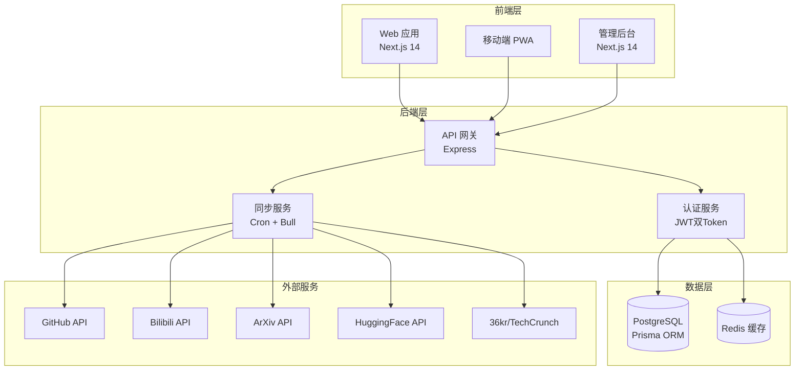

# Embodied Pulse 产品需求文档（PRD）

**产品名称**：Embodied Pulse（具身智能脉搏）  
**产品定位**：面向具身智能领域的专业化信息流聚合平台  
**产品类型**：Web 端信息流社区平台  
**目标用户**：具身智能领域研究人员、机器人工程师、AI/ML 学生、科技从业者  
**版本**：v5.1  
**文档状态**：已审核  
**创建日期**：2026-01-15  
**最后更新**：2026-02-15  
**主负责人**：Dong  

---

## 产品架构图



---

## 目录

1. [产品概述](#第一章产品概述)
2. [目标用户分析](#第二章目标用户分析)
3. [功能需求规格](#第三章功能需求规格)
4. [原型设计与交互规范](#第四章原型设计与交互规范)
5. [非功能性需求](#第五章非功能性需求)
6. [验收标准](#第六章验收标准)
7. [项目里程碑](#第七章项目里程碑)
8. [附录](#第八章附录)

---

## 第一章：产品概述

### 1.1 产品愿景与使命

Embodied Pulse 致力于打造具身智能领域最专业、最全面的信息聚合平台。我们的使命是帮助研究者和工程师更高效地发现、跟踪和分享具身智能领域的最新进展。通过整合论文、代码、模型、视频、求职等多维度资源，构建一个从学术研究到工业应用的完整信息生态链。平台采用 YouTube 风格的信息流浏览体验，让用户能够像刷视频一样轻松地发现优质内容，同时通过深度的社区互动功能，促进知识分享和思想碰撞。

### 1.2 核心价值主张

**信息聚合价值**：统一的信息流展示方式，将来自不同来源的优质内容汇聚到单一平台。

**社区互动价值**：完整的社区功能体系，包括帖子发布、评论互动、收藏订阅、关注系统等。

**零门槛访问**：渐进式功能解锁的设计理念，未登录用户可以浏览所有公开内容。

**数据真实性**：严格的数据校验机制，确保内容来源可靠、数据传输加密、存储安全。

### 1.3 产品发展战略

| 阶段 | 目标 | 核心指标 | 状态 |
|------|------|----------|------|
| 第一阶段 | 内容聚合与基础体验 | 内容覆盖率、用户留存率 | ✅ 已完成 |
| 第二阶段 | 智能推荐与个性化 | 推荐准确率、用户粘性 | 🔄 进行中 |
| 第三阶段 | 开放生态与商业化 | API调用量、商业收入 | 📋 待开始 |

---

## 第二章：目标用户分析

### 2.1 核心用户画像

| 用户类型 | 典型需求 | 使用场景 | 优先级 |
|----------|----------|----------|--------|
| 学术研究人员 | 论文检索、代码参考、会议信息 | 工作日碎片时间 | P0 |
| 工业界工程师 | 开源项目、模型库、招聘动态 | 通勤/午休时间 | P0 |
| AI/ML 学生 | 入门教程、学习路径、项目参考 | 学习时间 | P1 |
| 科技从业者 | 行业趋势、公司动态、应用案例 | 目的性访问 | P2 |

### 2.2 用户需求层次

| 需求层次 | 核心需求 | 功能支持 | 优先级 |
|----------|----------|----------|--------|
| 基础需求层 | 内容可发现性、信息准确性、页面加载速度 | 搜索、分类、筛选、性能优化 | P0 |
| 效率需求层 | 搜索效率、筛选效率、信息密度 | 高级搜索、智能排序、个性化推荐 | P0 |
| 社交需求层 | 身份认同、知识分享、社区归属 | 帖子、评论、关注、收藏 | P1 |
| 自我实现需求层 | 影响力建立、职业发展、学术成就 | 个人主页、贡献度、认证体系 | P2 |

---

## 第三章：功能需求规格

### 3.1 功能模块总览

| 模块 | 优先级 | 页面数 | 接口数 | 状态 |
|------|--------|--------|--------|------|
| 内容浏览 | P0 | 12 | 18 | ✅ 已完成 |
| 社区互动 | P1 | 6 | 12 | ✅ 已完成 |
| 个人中心 | P1 | 4 | 8 | ✅ 已完成 |
| 订阅系统 | P1 | 3 | 6 | ✅ 已完成 |
| 管理后台 | P1 | 20+ | 40+ | ✅ 已完成 |
| 数据同步 | P1 | - | 10 | ✅ 已完成 |

### 3.2 内容浏览模块

#### 3.2.1 内容类型与数据源

| 内容类型 | 数据来源 | 同步频率 | 详情页 | 状态 |
|----------|----------|----------|--------|------|
| 论文 | ArXiv, ICLR, NeurIPS, ICRA | 每小时 | ✅ | ✅ |
| 仓库 | GitHub API | 每15分钟 | ✅ | ✅ |
| 视频 | B站 API | 每小时 | ✅ | ✅ |
| 模型 | HuggingFace API | 每6小时 | ✅ | ✅ |
| 新闻 | 36kr, TechCrunch, MIT News | 每30分钟 | ✅ | ✅ |
| 职位 | 拉钩, Boss直聘 | 每天 | ✅ | ✅ |

#### 3.2.2 首页信息流

**功能描述**：首页采用信息流形式展示个性化推荐内容，混合展示论文、仓库、视频、模型、新闻等不同类型的内容。

**核心特性**：
- 无限滚动加载
- 内容类型筛选
- 个性化推荐
- 快捷导航Tab

**页面路由**：`/`

#### 3.2.3 论文模块

**功能描述**：提供具身智能领域学术论文的检索、浏览和阅读功能。

**核心页面**：
- 论文列表页：`/papers` - 卡片列表、筛选、排序
- 论文详情页：`/papers/[id]` - 完整信息、PDF链接、评论

**数据字段**：
| 字段 | 类型 | 说明 |
|------|------|------|
| arxivId | string | ArXiv标识符 |
| title | text | 论文标题 |
| authors | json | 作者列表 |
| abstract | text | 摘要 |
| pdfUrl | string | PDF链接 |
| citationCount | int | 引用数 |
| viewCount | int | 浏览数 |

#### 3.2.4 视频模块

**功能描述**：聚合B站和YouTube上与具身智能相关的技术视频。

**核心页面**：
- 视频列表页：`/videos`
- 视频详情页：`/videos/[id]`

**播放器集成**：
- B站视频：官方播放器组件
- YouTube：IFrame播放器

#### 3.2.5 仓库模块

**功能描述**：聚合GitHub上与具身智能相关的开源项目。

**核心页面**：
- 仓库列表页：`/repos`
- 仓库详情页：`/repos/[id]`

**数据同步**：GitHub REST API，热门仓库每15分钟同步

#### 3.2.6 模型模块

**功能描述**：聚合HuggingFace上的具身智能相关模型。

**核心页面**：
- 模型列表页：`/huggingface`
- 模型详情页：`/huggingface/[id]`

### 3.3 社区互动模块

#### 3.3.1 帖子功能

| 功能 | 路由 | 认证 | 状态 |
|------|------|------|------|
| 帖子列表 | `/community` | 否 | ✅ |
| 帖子详情 | `/community/[id]` | 否 | ✅ |
| 发布帖子 | `/my-community` | 是 | ✅ |
| 我的帖子 | `/my-community` | 是 | ✅ |

#### 3.3.2 互动功能

| 功能 | 说明 | 认证 |
|------|------|------|
| 点赞 | 对帖子/评论点赞 | 是 |
| 评论 | 发表评论和回复 | 是 |
| 收藏 | 收藏内容到个人收藏夹 | 是 |
| 分享 | 分享到社交媒体 | 否 |

### 3.4 订阅系统

#### 3.4.1 订阅类型

| 类型 | 说明 | 通知方式 |
|------|------|----------|
| 关键词订阅 | 按关键词匹配新内容 | 站内通知 |
| 标签订阅 | 按分类标签订阅 | 站内通知 |
| UP主订阅 | 订阅B站UP主新视频 | 站内通知 |

#### 3.4.2 订阅管理

- 订阅列表：`/subscriptions`
- 订阅详情：`/subscriptions/[id]`
- 新建订阅：快捷面板

### 3.5 用户系统

#### 3.5.1 认证方式

| 方式 | 说明 | 状态 |
|------|------|------|
| 邮箱密码 | 传统注册登录，支持邮箱验证码验证 | ✅ |
| 邮箱验证码 | 注册时验证邮箱真实性 | ✅ |
| 密码找回 | 通过邮箱重置密码 | ✅ |
| JWT Token | 双Token机制 | ✅ |

#### 3.5.2 用户中心

| 页面 | 路由 | 功能 |
|------|------|------|
| 个人资料 | `/profile` | 查看/编辑资料 |
| 设置 | `/settings` | 账号设置 |
| 收藏夹 | `/favorites` | 收藏管理 |
| 用户主页 | `/user/[id]` | 公开主页 |

#### 3.5.3 密码找回流程

| 步骤 | 说明 |
|------|------|
| 1. 输入邮箱 | 用户在忘记密码页面输入注册邮箱 |
| 2. 发送邮件 | 系统发送包含重置链接的邮件 |
| 3. 点击链接 | 用户点击邮件中的重置链接 |
| 4. 设置新密码 | 在重置页面输入新密码 |
| 5. 完成重置 | 密码更新成功，可使用新密码登录 |

### 3.6 管理后台

#### 3.6.1 功能模块

| 模块 | 路由 | 功能 |
|------|------|------|
| 数据概览 | `/admin` | 统计数据 |
| 用户管理 | `/admin/users` | 用户列表/编辑 |
| 管理员管理 | `/admin/admins` | 管理员列表 |
| 内容管理 | `/admin/content/*` | 各类内容管理 |
| 自定义页面 | `/admin/pages` | 自定义页面管理（富文本） |
| 数据同步 | `/admin/sync` | 同步任务管理 |
| 配置管理 | `/admin/*-keywords` | 关键词配置 |
| 系统配置 | `/admin/home-modules` | 首页模块配置 |

#### 3.6.2 自定义页面功能

**功能描述**：管理员可创建自定义页面，支持富文本编辑，用于展示公告、帮助文档等。

| 功能 | 说明 |
|------|------|
| 页面创建 | 创建新页面，设置标题和 slug |
| 富文本编辑 | 支持富文本内容编辑 |
| 页面排序 | 支持自定义排序 |
| 启用/禁用 | 控制页面是否公开显示 |
| 访问路径 | 用户端通过 `/page/[slug]` 访问 |

#### 3.6.3 权限体系

| 角色 | 权限范围 |
|------|----------|
| super_admin | 全部权限 + 管理员管理 |
| admin | 内容管理 + 用户管理 + 同步管理 |

---

## 第四章：原型设计与交互规范

### 4.1 设计原则

1. **内容优先**：减少装饰性元素，突出核心内容
2. **清晰层次**：使用字号、字重区分层级
3. **一致性**：统一的组件样式和交互模式
4. **高效交互**：减少操作步骤，提供快捷入口

### 4.2 页面布局规范

#### 4.2.1 全局布局

```
┌─────────────────────────────────────────────────────────────┐
│  Header (固定顶部)                                           │
│  Logo | 导航菜单 | 搜索 | 通知 | 用户菜单                      │
├─────────┬───────────────────────────────────────────────────┤
│ Sidebar │                                                   │
│ (可折叠)│              主内容区域                             │
│         │                                                   │
│ 订阅    │                                                   │
│ 收藏    │                                                   │
│ 设置    │                                                   │
└─────────┴───────────────────────────────────────────────────┘
```

#### 4.2.2 响应式断点

| 断点 | 宽度 | 布局 |
|------|------|------|
| xs | < 576px | 单列，侧边栏隐藏 |
| sm | ≥ 576px | 单列，侧边栏隐藏 |
| md | ≥ 768px | 单列，侧边栏可折叠 |
| lg | ≥ 992px | 双列，侧边栏固定 |
| xl | ≥ 1200px | 双列，侧边栏固定 |

### 4.3 组件规范

#### 4.3.1 色彩系统

| 用途 | 色值 | 说明 |
|------|------|------|
| 主色 | #1890FF | 主要按钮、链接 |
| 标题文字 | #262626 | 页面标题 |
| 正文文字 | #595959 | 主要内容 |
| 辅助文字 | #8C8C8C | 说明文字 |
| 分割线 | #F0F0F0 | 边框、分割 |
| 背景色 | #FAFAFA | 页面背景 |

#### 4.3.2 字体规范

| 层级 | 字号 | 字重 | 用途 |
|------|------|------|------|
| H1 | 24px | 600 | 页面主标题 |
| H2 | 20px | 600 | 模块标题 |
| H3 | 16px | 600 | 卡片标题 |
| 正文 | 14px | 400 | 主要内容 |
| 辅助 | 12px | 400 | 说明文字 |

#### 4.3.3 间距规范

| 级别 | 值 | 用途 |
|------|------|------|
| xs | 4px | 图标与文字 |
| sm | 8px | 紧凑元素 |
| md | 16px | 标准间距 |
| lg | 24px | 模块间距 |
| xl | 32px | 区块间距 |

---

## 第五章：非功能性需求

### 5.1 性能需求

| 指标 | 目标值 | 当前值 | 状态 |
|------|--------|--------|------|
| 首屏加载 (FCP) | < 1.5s | ~2s | ⚠️ 需优化 |
| 最大内容绘制 (LCP) | < 2.5s | ~3s | ⚠️ 需优化 |
| 累积布局偏移 (CLS) | < 0.1 | ~0.05 | ✅ 达标 |
| 首次输入延迟 (FID) | < 100ms | ~50ms | ✅ 达标 |
| API响应时间 (P95) | < 500ms | ~300ms | ✅ 达标 |

### 5.2 安全需求

| 检查项 | 状态 | 说明 |
|--------|------|------|
| JWT密钥分离 | ✅ | Access和Refresh使用不同密钥 |
| 输入验证 | ✅ | 关键路由已添加验证中间件 |
| XSS防护 | ✅ | React默认防护 + DOMPurify |
| SQL注入防护 | ✅ | Prisma ORM参数化查询 |
| CSRF防护 | ⚠️ | 建议添加CSRF Token |
| 密码加密 | ✅ | bcrypt加密存储 |

### 5.3 可用性需求

| 指标 | 目标 | 说明 |
|------|------|------|
| 系统可用性 | 99.9% | 年度可用性 |
| 故障恢复时间 | < 30min | MTTR |
| 数据备份 | 每日 | 自动备份 |

### 5.4 兼容性需求

| 类型 | 支持 | 说明 |
|------|------|------|
| 浏览器 | Chrome, Firefox, Safari, Edge | 最新两个版本 |
| 设备 | 桌面、平板、手机 | 响应式设计 |
| 操作系统 | Windows, macOS, Linux, iOS, Android | - |

---

## 第六章：验收标准

### 6.1 功能验收标准

| 模块 | 验收标准 | 状态 |
|------|----------|------|
| 内容浏览 | 所有内容类型可正常浏览、搜索、筛选 | ✅ |
| 用户认证 | 注册（含邮箱验证）、登录、密码找回正常工作 | ✅ |
| 社区功能 | 帖子发布、评论、点赞、收藏正常 | ✅ |
| 订阅系统 | 订阅创建、匹配、通知正常 | ✅ |
| 管理后台 | 所有管理功能正常工作 | ✅ |
| 数据同步 | 定时同步任务正常执行 | ✅ |
| 自定义页面 | 页面创建、编辑、展示正常 | ✅ |

### 6.2 性能验收标准

| 指标 | 验收标准 | 状态 |
|------|----------|------|
| 页面加载 | 首屏 < 3s | ✅ |
| API响应 | P95 < 500ms | ✅ |
| 并发支持 | 100并发用户 | ✅ |

### 6.3 安全验收标准

| 项目 | 验收标准 | 状态 |
|------|----------|------|
| 认证安全 | JWT双Token机制 | ✅ |
| 数据安全 | 敏感数据加密存储 | ✅ |
| 接口安全 | 输入验证、权限控制 | ✅ |

---

## 第七章：项目里程碑

### 7.1 版本历史

| 版本 | 日期 | 主要更新 |
|------|------|----------|
| v5.1 | 2026-02-15 | 邮箱验证码注册、密码找回、自定义页面、移除GitHub OAuth |
| v5.0 | 2026-02-13 | 系统架构文档、安全加固、Hydration修复 |
| v4.2 | 2026-02-03 | 管理后台完善、数据同步优化 |
| v4.0 | 2026-01-28 | 社区功能、订阅系统 |
| v3.0 | 2026-01-20 | 内容聚合、基础功能 |
| v2.0 | 2026-01-15 | 项目初始化 |

### 7.2 待办事项

| 优先级 | 任务 | 状态 |
|--------|------|------|
| P0 | 修复Hydration错误 | ✅ 已完成 |
| P0 | 邮箱验证码注册 | ✅ 已完成 |
| P0 | 密码找回功能 | ✅ 已完成 |
| P1 | 自定义页面功能 | ✅ 已完成 |
| P0 | 首屏性能优化 | 📋 待开始 |
| P1 | 智能推荐系统 | 📋 待开始 |
| P1 | 测试覆盖率提升 | 📋 待开始 |
| P2 | 移动端PWA优化 | 📋 待开始 |

---

## 第八章：附录

### 8.1 相关文档

| 文档 | 路径 | 说明 |
|------|------|------|
| 技术规格文档 | docs/技术规格文档SPEC_2026-02-13.md | 技术实现细节 |
| 系统架构文档 | ARCHITECTURE.md | 架构与业务流程 |
| API接口文档 | docs/API接口文档_2026-02-03.md | API详细说明 |
| 部署文档 | docs/部署文档_2026-02-03.md | 部署指南 |

### 8.2 技术栈版本

| 技术 | 版本 | 用途 |
|------|------|------|
| Next.js | 14.2.x | 前端框架 |
| Express | 4.18.x | 后端框架 |
| TypeScript | 5.3.x | 类型安全 |
| Prisma | 5.9.x | ORM |
| Ant Design | 5.12.x | UI组件库 |

### 8.3 联系方式

- 产品负责人：Dong
- 技术支持：查看项目README

---

**文档维护**：本文档应随产品演进持续更新。如有疑问或建议，请联系产品团队。