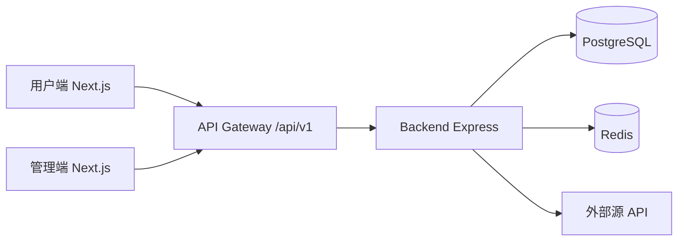
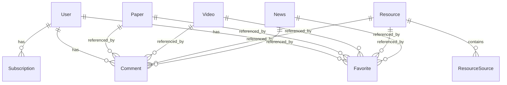

# Embodied Pulse Pro 全局架构蓝图

**文档类型**：开发全景图
**版本**：v1.0
**日期**：2026-02-25
**目的**：为研发提供统一的“页面-功能-路由-数据模型-模块依赖”总视图

---

## 一、系统边界与模块

- 用户端：信息流、内容浏览、认证、收藏、订阅、评论
- 管理端：用户/管理员/内容管理、同步任务、关键词/调度配置
- 后端：认证服务、内容服务、搜索服务、同步服务、管理服务

---

## 二、前端页面与功能矩阵

### 2.1 用户端（16页）

| 页面 | 路由 | 核心功能 | 认证 |
|---|---|---|---|
| 首页 | `/` | 聚合信息流、分类切换、收藏入口 | 否 |
| 论文列表/详情 | `/papers` `/papers/[id]` | 搜索筛选、详情阅读、评论收藏 | 否 |
| 视频列表/详情 | `/videos` `/videos/[id]` | 浏览播放、评论收藏 | 否 |
| 资源列表/详情 | `/resources` `/resources/[id]` | 按类型筛选、多来源展示、收藏 | 否 |
| 新闻列表/详情 | `/news` `/news/[id]` | 行业动态阅读、收藏 | 否 |
| 招聘列表 | `/jobs` | 岗位浏览、外链跳转 | 否 |
| 登录/注册/找回密码 | `/login` `/register` `/forgot-password` | 认证与账号恢复 | 否 |
| 个人中心 | `/profile` | 资料查看编辑、快捷入口 | 是 |
| 收藏夹 | `/favorites` | 收藏内容管理 | 是 |
| 订阅管理 | `/subscriptions` | 关键词与内容类型订阅规则 | 是 |

### 2.2 管理端（12页）

| 页面 | 路由 | 核心功能 |
|---|---|---|
| 管理首页 | `/admin` | 统计概览、同步状态 |
| 管理员登录 | `/admin/login` | 管理员认证 |
| 用户管理 | `/admin/users` | 用户查询与状态维护 |
| 管理员管理 | `/admin/admins` | 管理员账号维护 |
| 内容管理 | `/admin/content/papers` `/videos` `/resources` `/news` `/jobs` | 内容 CRUD |
| 数据同步 | `/admin/sync` | 手动触发同步与状态查看 |
| 定时任务 | `/admin/scheduler` | 调度策略维护 |
| 关键词管理 | `/admin/keywords` | 同步关键词与 UP 主配置 |

---

## 三、后端 API 总览（统一前缀）

**统一基线：`/api/v1/*`**

### 3.1 公开 API

- 认证：`/auth/register` `/auth/login` `/auth/refresh`
- 邮件/密码：`/email-verification/*` `/password-reset/*`
- 内容：`/feed` `/papers` `/videos` `/resources` `/news` `/jobs` `/search`

### 3.2 用户 API（需登录）

- 资料：`/user/profile` `/user/password`
- 收藏：`/favorites`
- 订阅：`/subscriptions`
- 评论：`/comments`

### 3.3 管理 API（需管理员权限）

- 认证：`/admin/login` `/admin/me`
- 用户与管理员：`/admin/users` `/admin/admins`
- 内容：`/admin/content/*`
- 同步：`/admin/sync/*`
- 系统：`/admin/keywords` `/admin/uploaders` `/admin/scheduler`

---

## 四、数据库结构与关系

### 4.1 表清单（16张）

- 用户域：`User` `Admin` `EmailVerification` `PasswordReset`
- 内容域：`Paper` `Video` `Resource` `ResourceSource` `News` `Job` `Uploader`
- 交互域：`Favorite` `Subscription` `Comment`
- 系统域：`Keyword` `SyncLog`

### 4.2 核心关系

说明：`Favorite` 与 `Comment` 通过 `contentType + contentId` 关联多内容实体（多态关联）。

---

## 五、页面到 API 到数据表映射

| 前端页面模块 | 主要 API | 主要数据表 |
|---|---|---|
| 首页信息流 | `GET /api/v1/feed` | `Paper` `Video` `Resource` `News` `Job` |
| 论文模块 | `GET /api/v1/papers*` | `Paper` `Comment` `Favorite` |
| 视频模块 | `GET /api/v1/videos*` | `Video` `Uploader` `Comment` `Favorite` |
| 资源模块 | `GET /api/v1/resources*` | `Resource` `ResourceSource` `Favorite` `Comment` |
| 新闻模块 | `GET /api/v1/news*` | `News` `Favorite` `Comment` |
| 招聘模块 | `GET /api/v1/jobs` | `Job` |
| 认证模块 | `/api/v1/auth/*` `/api/v1/email-verification/*` `/api/v1/password-reset/*` | `User` `EmailVerification` `PasswordReset` |
| 个人中心 | `GET/PUT /api/v1/user/profile` | `User` |
| 收藏夹 | `/api/v1/favorites` | `Favorite` + 各内容表 |
| 订阅管理 | `/api/v1/subscriptions` | `Subscription` `Keyword` |
| 管理端内容管理 | `/api/v1/admin/content/*` | 全内容表 |
| 数据同步与调度 | `/api/v1/admin/sync/*` `/api/v1/admin/scheduler*` | `SyncLog` `Keyword` `Uploader` |

---

## 六、开发执行顺序（与 TASKS.md 对齐）

1. 基础设施：`TASK-001~TASK-004`（脚手架、token、后端基建、数据库）
2. 前台主链路：`TASK-005~TASK-008`（组件、公开页、登录态页）
3. 管理与联调：`TASK-009~TASK-012`（管理端、同步、验收）

门禁要求：
- API 契约统一 `/api/v1/*`
- 页面清单统一 16（用户端）+12（管理端）
- UI 特效仅使用白名单组件，且支持 `prefers-reduced-motion`

