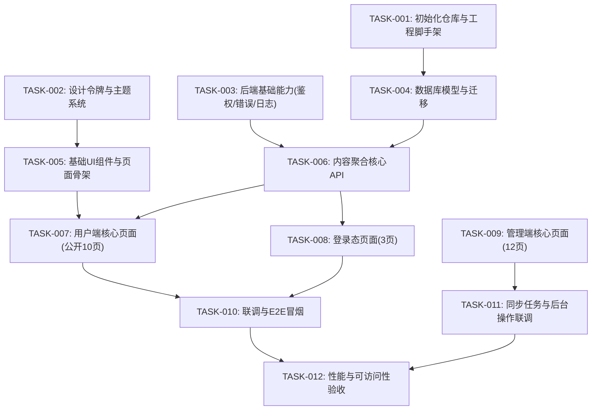

# Embodied Pulse Pro 开发前准备与任务计划

**文档类型**：开发前准备
**版本**：v1.0
**日期**：2026-02-25
**输入文档**：
- `docs/01-需求/PRD_EmbodiedPulsePro_20260225.md`
- `docs/01-需求/需求分析文档_20260225.md`
- `docs/02-设计/技术规格文档SPEC_20260225.md`
- `docs/02-设计/UI设计规范_20260225.md`
- `docs/02-设计/用户端原型图_20260225.md`
- `docs/02-设计/管理端原型图_20260225.md`

---

## 一、文档质量检查结论

### 1.1 高优先级问题（必须先修）

1. 用户端页面数量描述不一致
- 现象：`需求分析文档` 写“14个”，但实际列表为 10+3+3=16。
- 影响：任务估算、测试范围、排期都可能低估。
- 处理：已改为 16 个。

2. 用户端原型缺失 `forgot-password` 与 `subscriptions`
- 现象：原型清单只有 14 项，缺少 PRD/SPEC 中已定义页面。
- 影响：前端开发无参照，导致后续返工。
- 处理：已补齐清单与低保真原型。

### 1.2 中优先级问题（首周内修复）

1. API 路径版本前后不一致（已修复）
- 现象：PRD 使用 `/api/*`，SPEC 使用 `/api/v1/*`。
- 处理：已统一到 `/api/v1/*`，并以 SPEC 作为接口契约基线。

2. UI 规范可执行性不足（旧版）
- 现象：缺动效边界、可访问性门槛、特效白名单与降级策略。
- 处理：已升级到 UI 规范 v1.1，新增性能与无障碍门禁。

### 1.3 低优先级问题（迭代中收敛）

1. 部分原型示例数据过于理想化，建议后续引入真实数据长度进行压测。
2. 资源分类标签数量较多，建议后续补一个“标签折叠/展开”交互规范。

---

## 二、当前基线（可开工）

- 需求基线：PRD + 需求分析文档（MVP范围明确）
- 技术基线：SPEC（技术栈、API、数据模型明确）
- 设计基线：UI设计规范 v1.1 + 双端原型图
- 结论：可进入开发阶段，接口契约已统一，后续按 TASKS 执行即可

---

## 三、开发任务 DAG（MVP）

---

## 四、里程碑与验收口径

### M1（第1周）
- 完成：`TASK-001~TASK-004`
- 验收：本地可运行、数据库迁移成功、接口基础中间件可用

### M2（第2周）
- 完成：`TASK-005~TASK-008`
- 验收：用户端 13 个核心页面（公开页 + 登录态页）可访问，UI token 生效

### M3（第3周）
- 完成：`TASK-009~TASK-012`
- 验收：管理端可用、全链路联调通过、性能和可访问性达标

---

## 五、开发前检查清单（Go/No-Go）

- [x] API 前缀统一为 `/api/v1/*`
- [ ] 环境变量模板完成（前后端 + DB + Redis）
- [ ] Prisma schema 与 SPEC 表结构一致
- [ ] UI token 与主题方案落地（AntD + Tailwind 分工明确）
- [ ] 动效组件严格遵守白名单
- [ ] 至少 1 条从“抓取 -> 存储 -> 展示”的端到端链路跑通
